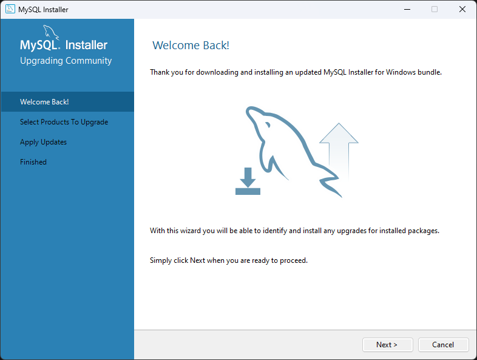
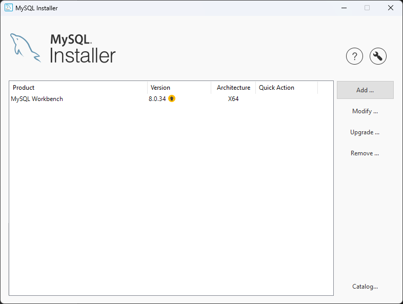
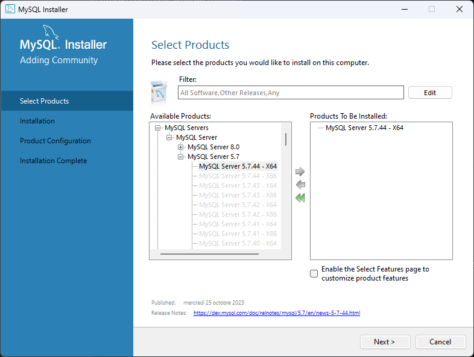
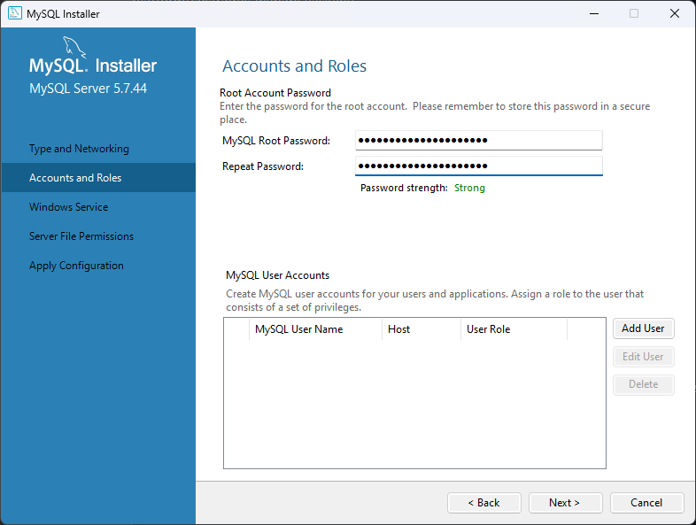

# Advanced installation

It is possible to run SoSTrades on Windows without installing docker by running some scripts. It is recommended to follow step by step the installation below, because if you skip a script the next could not work. Every script is stored in the folder `sostrades-dev-tools\scripts\`

## 1. Prerequisites

The repository sostrades-dev-tools and all scripts need the following prerequisites :
> - Python version 3.9 : https://www.python.org/downloads/release/python-3913/
> - Git : https://git-scm.com/download/win
> - Python module "mysql.connector" : `pip install mysql-connector-python`
> - Mysql v5.7 : follow the part ## 2. Install MySQL

## 2. Install MySQL

The SoSTrades Graphical User Interface needs a dedicated database with two tables "sostrades-data" and "sostrades-log".
First download [mysql-installer-community](https://dev.mysql.com/get/archives/mysql-installer/mysql-installer-community-8.0.32.0.msi).
Launch "mysql-installer-community-8.0.32.0.msi" from the previous file downloaded. If you have the following screen it means you already have some product of MySQL, check if your MySQL Server can be upgraded to the version **MySQL Server 5.7.44**.



If you never installed any MySQL products you will get this screen. Click on Add button and select **MySQL Server 5.7.44 - x 64** you can also add MySQL WorkBench if you need to visualise the future database.



If you can not find MySQL 5.7, click on "Edit" and change the filter of "Maturity" field to "Other Releases".




Once the MySQL Server is selected click on Next then execute on the next screen. Let everything by default until to get the screen asking you to enter the password. Enter you password twice and click next to complete all the installation of MySQL.



Store wisely the password of root user. It will be asked later for the SoSTrades install.

## 3. Run detailed install scripts

Clone the repository sostrades-dev-tools to get the installation scripts.

```
git clone https://github.com/os-climate/sostrades-dev-tools.git
```
The following actions will be a long list of script executions to understand and how the SoSTrades install is performed. If you do not care about these details go directly the end of this paragraph.  


If you want to start a detailed install, start to run `PrepareDevEnv.py` from `sostrades-dev-tools` folder to clone all models and platform repository needed:

```
python scripts\PrepareDevEnv.py
```

Then run `PrepareVenv.py` to install venv named sostrades-venv:

```
python scripts\PrepareVenv.py
```

Then run `Configuration.py` to create folder and files needed to run SoSTrades:

```
python scripts\Configuration.py
```

Then run `NodeInstallation.py` to install NVS with the good version of Node at the end of the script it will ask you if you want to build the webgui:

```
python scripts\NodeInstallation.py 
```

Then run script is `EditFlaskenv.py` to modify the .flaskenv file with your SQL credentials (user=root and the password is the same in the MySQL installation section):

```
python scripts\EditFlaskenv.py
```

To create "sostrades-data" and "sostrades-log" tables run `CreateDatabases.py`:

```
python scripts\CreateDatabases.py
```

To create an user to access to SoSTrades platform run `CreateUser.py`:

```
python scripts\CreateUser.py
```

If you want to update Ontology execute the script `UpdateOntology.py`. This script could take more than 15mn it depends on the number of repository you have.

```
python scripts\UpdateOntology.py
```

For direct full install, execute the script `FullInstall.py`
```
python scripts\FullInstall.py
```

## 4. Start SoSTrades platform 

Finally run the script `StartSOSTrades.py` to launch SoSTrades :

```
python scripts\StartSOSTrades.py
```

When the last script is running you can go to [http://localhost:4200](http://localhost:4200) with your web browser and connect with your credentials just created before.

## 5. Run venv

To run sostrades-venv with all requirements installed, run the following command from your `sostrade-dev-tools` folder:

```
sostrades-venv\Scripts\activate
```

To exit the venv just use this command

```
deactivate
```

## 6. Pull repositories

If you need to pull all your repositories (both platform and models) you can execute the script `PullRepositories.py` : 

```
python scripts\PullRepositories.py
```
## 7. Scripts explanation
> - PrepareDevEnv.py : script to download all model repositories from model_repositories.json and platform repositories from platform_repositories.json with git clone command. Repositories are cloned in sostrades-dev-tool\models and sostrades-dev-tool\platform. The script also creates a `sostrades-dev-tools\.vscode\setting.json` file with extraPaths according to the repository cloned,

> - PrepareVenv.py: script to install a venv in the folder `sostrades-dev-tools\sostrades-venv\` with the python 3.9 and install all requirements of SoSTrades,

> - Configuration.py: script to create files and folders needed by SoSTrades
>> - `sostrades-dev-tools\platform\sostrades-webapi\sos_trades_api\configuration_template\configuration.json`
>> - `sostrades-dev-tools\platform\sostrades-webapi\.flaskenv`
>> - `C:\TEMP\SOSTRADES\`
>> - `C:\TEMP\SOSTRADES\REFERENCES\`
>> - `C:\TEMP\SOSTRADES\RSA\`
>> - `C:\TEMP\SOSTRADES\RSA\private_key.pem`
>> - `C:\TEMP\SOSTRADES\RSA\public_key.pem`

> - `NodeInstallation.py`: script to install a NVS (Node Version Switcher) and also install a version of Node with NVS. In addition it is possible to build sostrades-webgui

> - `EditFlaskenv.py`: script to modify the values `SQL_ACCOUNT`, `SQL_PASSWORD`, `LOG_USER`, `LOG_PASSWORD` in the file `sostrades-dev-tools\platform\sostrades-webapi\.flaskenv`

> - `CreateDatabases.py` : script that creates `sostrades-data` and `sostrades-log` tables in database needed for the API.

> - `CreateUser.py` : script that creates an user in SoSTrades with the command `flask create_standard_user`. When the user is created, a password is temporarily saved in `sostrades-dev-tools\platform\sostrades-webapi\sos_trades_api\secret\*`. Once stored, the password has to be deleted. Some SoSTrades app rights are granted in the database.

> - `UpdateOntology.py` script will execute with your `sostrades-venv` the command `python sos_ontology\core\script\createSoSOntologyFromCode.py`in `sostrades-ontology` folder to update ontology with all your repositories

> - `StartSOSTrades.py` : script that run api server, ontology server, and webgui server with venv and node